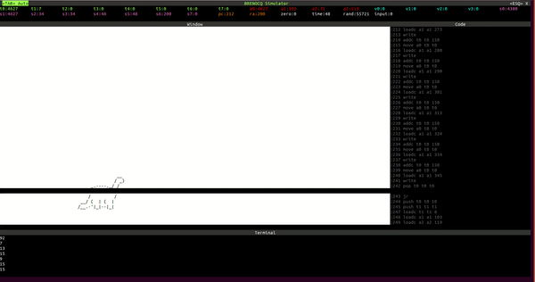
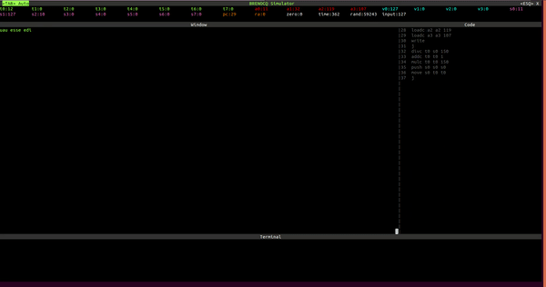
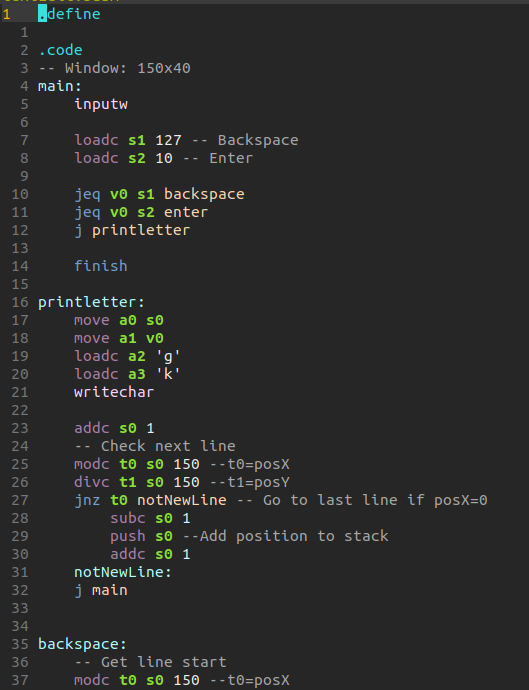
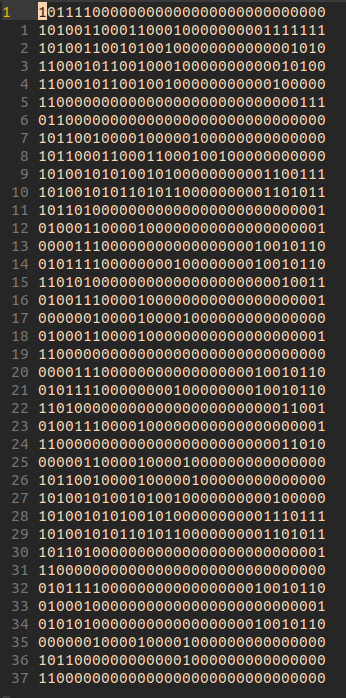
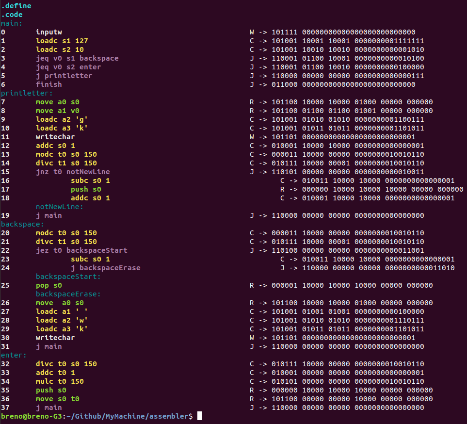
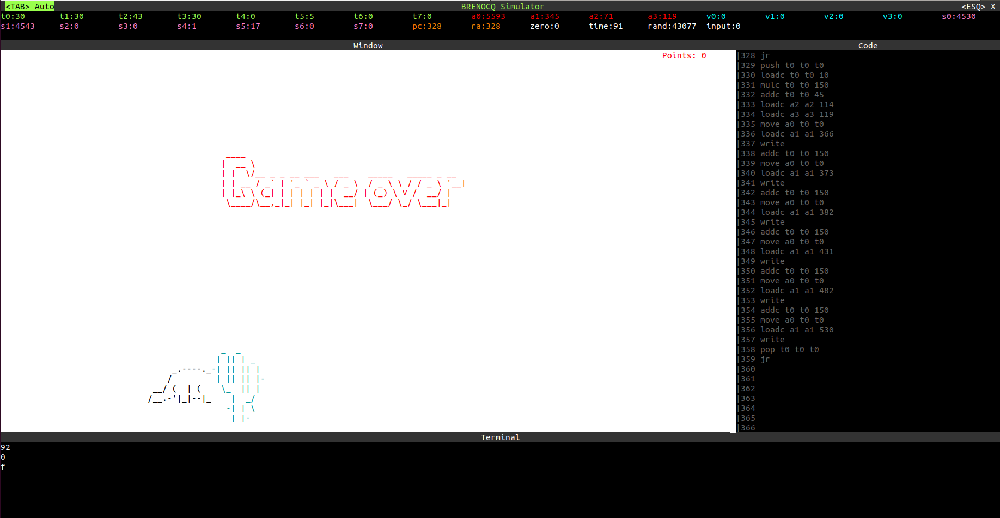
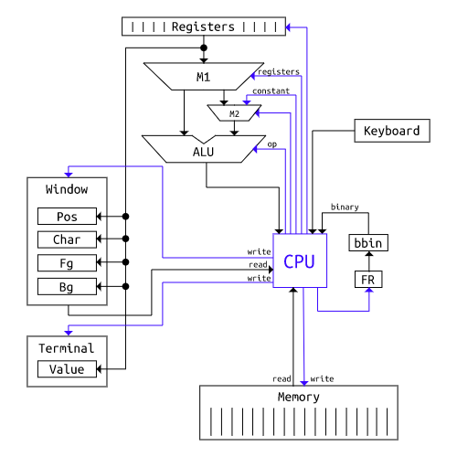

# MyMachine
<p align="center">


</p>

This processor was based on the [processor developed by the ICMC](https://github.com/simoesusp/Processador-ICMC). This project is divided into two parts: the assembler and processor simulator.

The assembler, which is a program developed in C++ to read a `.basm` file (assembly) and transform it into a `.bbin` file (binary). The structure of these two types of extensions were also developed in this project and will be explained later.

The simulator consists of a program that reads the instructions from the `.bbin` file line by line and executes them. The simulator is using ncurses to create a terminal interface. The architecture being simulated, as well as the different parts of the simulator will be explained later.

# Installation
```
sudo apt-get install ncurses-dev
git clone https://github.com/Brenocq/MyMachine.git
cd MyMachine/assembler
make
cd ../simulator
make
```

# Files
<p align="center">

 ----->

</p>
To create a program for this processor, you must first write the code in assembly. After writing the assembly program, you must use the assembler to transform this assembly (`.basm` left image) into a binary file (`.bbin` right image). The **basm language** was developed in this project, it is necessary to follow its structure to create code that can be converted to binary correctly.

# Assembler
<p align="center">

</p>
When running the assembler, you must pass the .basm file you want to convert to binary.

```
./assembler/bin/assembler <.bbam file>
# or
./assembler/bin/assembler <.bbam file> <.bbin file>
```
If you pass just one file, the generated .bbin file will have the same name and will be stored in the same directory.
</br>
When you run the assembler, it shows in the terminal how each line was converted (image above), you can use this output to debug if any lines were converted incorrectly.

# Simulator
<p align="center">

</p>

When running the simulator, you must pass the .bbin file you want to run as an argument.

```
./simulator/bin/simulator <.bbin file>
```

You can quit the simulator pressing <ESQ>.
You can control the simulator mode with <TAB>.
 - Manual mode: Executes the code line by line each time a key is pressed.
 - Auto mode: Executes the code until it finds a finish command.

The simulator interface is divided into 4 parts: Top bar, window, code, terminal.

### Top bar
In the topbar the value of each register is displayed.

### Code
The assembly code being executed and the next lines are shown on the right.

### Window
In the middle, the window that can be manipulated in the assembler is displayed. Its size is 150 x 40.

### Terminal
At the bottom, the terminal that can be used to display some values from the assembler is shown.

# Examples

### Text editor
```
cd MyMachine
./assembler/bin/assembler examples/textEditor/textEditor.basm
./simulator/bin/simulator examples/textEditor/textEditor.bbin
```
### Dinosaur
```
cd MyMachine
./assembler/bin/assembler examples/dinosaur/dinosaur.basm
./simulator/bin/simulator examples/dinosaur/dinosaur.bbin
```
# The Machine
### Architecture
<p align="center">

</p>
This processor is mainly controlled by the CPU. The CPU is connected to 5 main components: Registers, Window, Terminal, Memory, and Keyboard. Also, the CPU controls which operation and operators will be used by the ALU.
For each line in the `.bbin` file, the CPU controls one sequence of actions. FR is a register that stores the current line number.

### Registers
Types of registers:
 - **t** (0-7): Should be used to perform temporary operations
 - **a** (0-3): Should be used to send parameters to a functions
 - **v** (0-3): Should be used to send the result of a function
 - **s** (0-7): Should be used to store a value used throughout the program
 - **rand**: At each cycle, this register is changed to a value between 0-65535
 - **time**: This counter is added every 100ms
 - **input**: Whenever a key is pressed on the keyboard, its ascii value is sent to this register.
 - **zero**: Always zero, used to compare whether a value is zero

Obs: Negative values are not yet supported
#### Register table
| Special registers |  Temporary registers  | Argument registers | Function result | Saved temporary
| ---  | --- | ---| ---| ---|
|  pc  |  t0 | a0 | v0 | s0 |
|  ra  |  t1 | a1 | v1 | s1 |
| rand |  t2 | a2 | v2 | s2 |
| time |  t3 | a3 | v3 | s3 |
|input |  t4 |    |    | s4 |
| zero |  t5 |    |    | s5 |
|     |  t6 |    |    | s6 |
|      |  t7 |    |    | s7 |


### Commands
**Arithmetic Instructions:**
 - **add** _reg0 reg1 reg2_ -------- reg0 = reg1+reg2
 - **addc** _reg0 reg1 const_ -------- reg0 = reg1+cosnt
 - **sub** _reg0 reg1 reg2_ -------- reg0 = reg1-reg2
 - **subc** _reg0 reg1 const_ -------- reg0 = reg1-cosnt
 - **mul** _reg0 reg1 reg2_ -------- reg0 = reg1*reg2
 - **mulc** _reg0 reg1 const_ -------- reg0 = reg1*cosnt
 - **div** _reg0 reg1 reg2_ -------- reg0 = reg1/reg2
 - **divc** _reg0 reg1 const_ -------- reg0 = reg1/cosnt
 - **mod** _reg0 reg1 reg2_ -------- reg0 = reg1%reg2
 - **modc** _reg0 reg1 const_ -------- reg0 = reg1%cosnt
 - **shiftl** _reg0 reg1 reg2_ -------- reg0 = reg1<<reg2
 - **shiftlc** _reg0 reg1 const_ --------  reg0 = reg1<<cosnt
 - **shiftr** _reg0 reg1 reg2_ --------  reg0 = reg1>>reg2
 - **shiftrc** _reg0 reg1 const_ --------  reg0 = reg1>>cosnt

**Logical Instructions:**
- **and** _reg0 reg1 reg2_ -------- reg0 = reg1 && reg2
- **or** _reg0 reg1 reg2_ -------- reg0 = reg1 || reg2
- **xor** _reg0 reg1 reg2_ -------- reg0 = reg1 != reg2
- **not** _reg0 reg1_ -------- reg0 = !reg1

**Jump Instructions:**
- **j** -------- jump
- **jeq** _reg0 reg1_ -------- jump if reg0 == reg1
- **jne** _reg0 reg1_ -------- jump if reg0 != reg1
- **jez** _reg0_ -------- jump if reg0 == 0
- **jnz** _reg0_ -------- jump if reg0 != 0
- **jgt** _reg0 reg1_ -------- jump if reg0 > reg1
- **jge** _reg0 reg1_ -------- jump if reg0 >= reg1
- **jlt** _reg0 reg1_ -------- jump if reg0 < reg1
- **jle** _reg0 reg1_ -------- jump if reg0 <= reg1

**Jump and link Instructions:**

Like jump instructions, but saves the current **pc** in the **ra** register. It can be used later to return to the line where it was called using the command `jr`.

- **jl** -------- jump and link
- **jeql** _reg0 reg1_ -------- jump if reg0 == reg1 and link
- **jnel** _reg0 reg1_ -------- jump if reg0 != reg1 and link
- **jezl** _reg0_ -------- jump if reg0 == 0 and link
- **jnzl** _reg0_ -------- jump if reg0 != 0 and link
- **jgtl** _reg0 reg1_ -------- jump if reg0 > reg1 and link
- **jgel** _reg0 reg1_ -------- jump if reg0 >= reg1 and link
- **jltl** _reg0 reg1_ -------- jump if reg0 < reg1 and link
- **jlel** _reg0 reg1_ -------- jump if reg0 <= reg1 and link

**Memory Access Instructions:**
- **loadc**  _reg0 const_ -------- reg0 = const

**Data Movement Instructions:**
- **move**  _reg0 reg1_ -------- reg0 = reg1

**Stack Instructions:**
- **push**  _reg0_ -------- push reg0 to the stack
- **pop**  _reg0_ -------- pop from the stack to reg0

**Exception and Interrupt Instructions:**
- **finish** -------- stop the program

**Terminal Instructions:**
- **printbool** -------- prints a boolean value to the terminal
- **printchar** -------- prints a char value to the terminal
- **printint** -------- prints a integer value to the terminal
- **printstr** -------- prints a string to the terminal
- **printnl** -------- prints a new line in the terminal

Before printing a value to the terminal, you must send this value to the **a0** register.Example:
```
move a0 t0
printint
```

**Window Instructions:**
- **writebool** -------- write a boolean value to the window
- **writechar** -------- write a char value to the window
- **writeint** -------- write a integer value to the window
- **writestr** -------- write a string to the window
- **read** -------- read a window position

Before sending a write command, you must populate **a0** (position),  **a1** (char), **a2** (foreground color), **a3** (background color). Example:
```
loadc a0 0 -- write to position 0
loadc a1 'B' -- write character B
loadc a2 'r' -- red foreground color
loadc a3 'b' -- black background color
writechar
```

The result from the read command will be return by the **v0**, **v1**, **v2** registers. Example:
```
loadc a0 10 -- read from position 10
read
-- v0: char
-- v1: foreground color
-- v2: background color=
```

# License
This project is licensed under the MIT License - see the [LICENSE](LICENSE) file for details.
